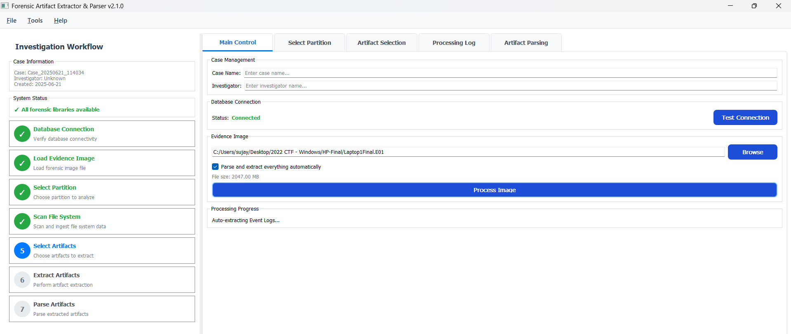
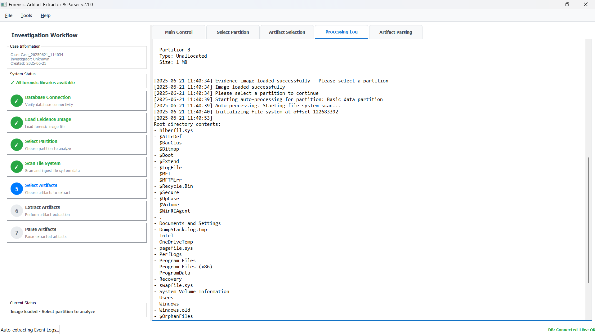

<div align="center">
  <h1>🔍 Forensics Artifact Extractor & Parser</h1>
  <h3>End-to-End Automated Forensic Artifact Extractor and Parser for E01 Images</h3>

  <p>
    
    
    
    
    
  </p>
</div>

---

## 🧠 What is FAEP?

**Forensics Artifact Extractor & Parser** is an intelligent and completely automated digital forensics tool designed to extract and parse artifacts from forensic disk images, especially `E01` files. Just load the image and let the tool do everything: extract, process, and generate parsed outputs using industry-standard tools — all in one click.

It’s built for DFIR professionals, forensic analysts, and cybersecurity researchers who want **speed, reliability, and automation while investigating E01 images**.

---

## 🚀 Features

- 📂 **Full Artifact Extraction** from `.E01` images  
- 🧰 **Built-in Integration** with top tools:
  - `RegRipper`
  - `AmcacheParser`
  - `Hindsight`
  - `EvtxECmd`
  - `MFTECmd`
  - and many more...
- 📜 **Auto-parsing of**:
  - `NTUSER.DAT`, `SAM`, `SYSTEM`, `SOFTWARE`
  - `Amcache.hve`, `SRUDB.dat`, `Prefetch`
  - `Event Logs`, `Web History`, etc.
- 🖥️ Clean GUI (or CLI optional)
- 🧾 Consolidated and human-readable output
- 📁 Saves parsed output with proper timestamped folders
- ⏱️ Minimal manual intervention

---

## 🧩 Supported Artifacts

| Artifact Type     | Tool Used         |
|-------------------|------------------|
| Registry Hives    | RegRipper        |
| Web Artifacts     | Hindsight        |
| App Execution     | AmcacheParser    |
| User Activity     | SRUM Parser      |
| Prefetch Files    | PECmd            |
| Event Logs        | EvtxECmd         |
| MFT / USN Journal | MFTECmd / UsnJrnlParser |

---

## 📸 Screenshots

<!-- Add screenshots after uploading them to your repo -->
<p align="center">
  
  <br/>
  <em>Figure 1: Dashboard</em>
</p>

<p align="center">
  
  <br/>
  <em>Figure 2: Disk Partitions</em>
</p>

<p align="center">
  
  <br/>
  <em>Figure 3: Processing of image</em>
</p>

---

## 🛠️ Installation

### 🔹 Prerequisites

- Python 3.10+
- pip
- Windows OS (Recommended for tool compatibility)
- Admin permissions
- Postgres DB

### 🔹 Clone and Setup

1. Option A
```bash
git clone https://github.com/sujayadkesar/FAEP.git
cd FAEP
pip install -r requirements.txt
python FAEP_GUI.py
```
2. Option B (recommended)
   Direct installer (exe)

---


Then, follow the GUI prompts to:

1. Load `.E01` file  
2. Choose Output Directory  
3. Hit `Process All`  
4. Parsed results will be saved in `ParsedArtifacts/YYYY-MM-DD_HH-MM/`

You can also run in **headless mode** for batch automation. *(Docs coming soon)*

---


## 🤝 Contributing

PRs and suggestions are welcome! Please fork the repository and open an issue or submit a pull request.

---

## 📜 License

MIT License. See `LICENSE` file for more details.
---

## 🙌 Acknowledgments

- [Akhil Dara](https://www.linkedin.com/in/akhil-dara/)
- [Jnana Ramakrishna](https://www.linkedin.com/in/jnana-ramakrishna/)
- [Eric Zimmerman Tools](https://ericzimmerman.github.io/)
- [Hindsight by Ryan Benson](https://github.com/obsidianforensics/hindsight)
- [RegRipper by Harlan Carvey](https://github.com/keydet89/RegRipper4.0)

---
```
digital forensics, E01 parser, amcache parser, registry parser, forensic automation tool, DFIR, hindsight automation, SRUM parser, artifact extractor, python forensic tool, AutoForenParse, Forensic artifacts parser
```
